[← Back to Projects](/projects/)

# Lab: Kali (OpenVAS/CIS Benchmark) → Metasploitable - Multi-vulnerability Remediation

**Author:** Tung Nguyen  
**Date:** 2025-11-05  
**Environment:** Kali attacker VM + Metasploitable target VM (host-only network)

---

## Summary
This lab demonstrates the discovery and remediation of high-impact vulnerabilities on a Metasploitable 2 VM using Greenbone/OpenVAS (GVM) as the primary scanning tool. Given that Metasploitable 2 contains hundreds of intentionally vulnerable services, this project focuses on realistic and critical issues, guided by the CIS Ubuntu Linux Benchmark to prioritize remediation.

Each vulnerability is documented with:
- Pre-remediation evidence (OpenVAS scan, nmap, service testing, screenshots)
- Root cause analysis
- Remediation steps aligned with CIS guidance
- Post-remediation verification

This approach ensures reproducibility, demonstrates secure configuration practices, and aligns lab remediation with industry standards.

---

## Environment & VM configuration
- Hypervisor: VirtualBox / VMware  
- Kali VM: 6 GB RAM, 2 CPU, host-only network  
- Metasploitable VM: 1 GB RAM, 1 CPU, host-only network  
- Tools used: Greenbone/OpenVAS (GVM), nmap, ss/netstat, bash, basic Linux utilities  

---

## Workflow Summary
1. Boot Kali and Metasploitable VMs on an isolated host-only network.  
2. Identify the target IP with host discovery (`nmap`).  
3. Start Greenbone/OpenVAS (`gvm-start`) and run a full system scan.  
4. Review OpenVAS results and map each finding to relevant **CIS Ubuntu Linux Benchmark** controls.  
5. Prioritize vulnerabilities using CIS guidance (disable insecure services, remove backdoors, enforce authentication, update legacy software).  
6. Investigate each finding on the Metasploitable VM (`inetd.conf`, service configs, version checks, credential testing).  
7. Apply remediation according to CIS recommendations (disable service, remove package, enforce password, etc.).  
8. Re-scan with OpenVAS and validate remediation (port closed, login blocked, service removed).  
9. Document all evidence and before/after comparisons.

---

## Table of Contents (CIS Benchmark Aligned)
**1. Initial Setup - Secure OS Defaults**
- [Future Work!]()

**2. Services - Disable, Remove Insecure Services**
- [Ingreslock Backdoor (Port 1524)](#ingreslock-backdoor-port-1524)  
- [Rexec / r-services (Port 512)](#rexec-r-services-port-512)  
- [rlogin Passwordless Login (Port 513)](#rlogin-passwordless-login-port-513)  
- [vsftpd 2.3.4 Backdoored Version (Ports 21 & 6200)](#vsftpd-2-3-4-backdoored-version-ports-21-6200)
- [Distributed Ruby (dRuby/DRb) RCE (Port 8787)](#vulnerability-druby-rce-port-8787)
- [Telnet Unencrypted Cleartext Login (Port 23)](#telnet-cleartext-login-port-23)
- [rsh Unencrypted Cleartext Login (Port 514)](#rsh-cleartext-login-port-514)
- [FTP Unencrypted Cleartext Login (Port 2121)](#ftp-cleartext-login-port-2121)
- [DistCC Remote Code Execution (Port 3632)](#distcc-rce-port-3632)

**3. Network Configuration - Limit Remote Exposure**  
- Restricted PostgreSQL (Port 5432) to admin host
  *(See Section 7: SSL/TLS OpenSSL CCS Injection Vulnerability for details)*

**4. Host-Based Firewall - Traffic Filtering**
- Implemented iptables rules to restrict PostgreSQL (Port 5432) access to the admin host only

**5. Access Control - Authentication & Permissions**
- [MySQL / MariaDB Default Credentials (Port 3306)](#mysql-mariadb-default-credentials-port-3306)

**6. Logging & Auditing - Event Monitoring**
- [Future Work!]()

**7. System Maintenance - Patching & Integrity**
- [SSL/TLS: OpenSSL CCS Injection Vulnerability (Port 5432)](#openssl-ccs-injection-port-5432)

<!-- ---

## Vulnerability Template
Use this template to add additional vulnerabilities:

### Vulnerability: <SHORT TITLE> — <SERVICE / PORT>
**Severity:** <High / Medium / Low>  
**OpenVAS ID / Reference:** <OpenVAS NVT or CVE>  

**Description (short):**  
A one-sentence summary of the issue.

**Evidence (pre-remediation):**
- GVM finding screenshot: `/images/<filename>`  
- `nmap` or port scan output:
# Example
nmap -sT -p 1-65535 <target-ip> -->

---

### Vulnerability: Ingreslock Backdoor (Port 1524) {#vulnerability-ingreslock-backdoor-port-1524}
**Severity:** High  
**OpenVAS ID / Reference:** NVT – *TCP Port 1524: Ingreslock Backdoor*

**Description (short):**  
The `inetd` configuration contained an entry that spawned `/bin/bash` as root when the service was contacted. This effectively functions as a backdoor, allowing anyone who can connect to that port to obtain a root shell.

**Evidence (pre-remediation):**
- OpenVAS finding screenshot:  
  
- `nmap` scan showing port 1524 open (before remediation):
  
- Snippet of `/etc/inetd.conf` showing the malicious entry:
  

**Root cause analysis:**  
A line in `/etc/inetd.conf` mapped the `ingreslock` service to `/bin/bash` and ran it as `root`. Since `inetd` launches the configured program with root privileges, any network connection to that service resulted in a root shell being spawned.

**Remediation performed:**  
1. Removed the malicious `ingreslock` line (`ingreslock stream tcp nowait root /bin/bash bash -i`) from `/etc/inetd.conf`.
2. Reboot to apply the change.
3. Scan again using nmap to make sure the port is closed and unable to netcat to it anymore.

---

### Vulnerability: Rexec / r‑services (Port 512) {#vulnerability-rexec-r-services-port-512}

**Severity:** High  
**OpenVAS ID / Reference:** NVT – *TCP Port 512: rexec (r‑services)*

**Description (short):**  
The target exposes the legacy `rexec` (r‑services) daemon on TCP port 512. R‑services transmit credentials in plaintext and are considered insecure; an exposed `rexec` allows remote command execution and is a significant misconfiguration.

**Evidence (pre-remediation):**
- OpenVAS finding screenshot:  
  
- `nmap` scan showing port 512 open (before remediation):  
  
- `inetd` configuration showing the `rexec` entry (example):  
    
  _Observed line (lab):_  
exec stream tcp nowait root /usr/sbin/tcpd /usr/sbin/in.rexecd

**Root cause analysis:**  
The `rexec` service was enabled via the system's `inetd` configuration. Because rexec performs plaintext authentication and is rarely required, having it enabled on a networked host exposes credentials and allows remote execution.

**Remediation performed:**  
1. Removed/disabled the `rexec` entry (`exec stream tcp nowait root /usr/sbin/tcpd /usr/sbin/in.rexecd`) from the inetd configuration.
2. Reboot to apply the change.
3. Scan again using nmap to make sure the port is closed.

---

### Vulnerability: MySQL / MariaDB Default Credentials (Port 3306) {#vulnerability-mysql-mariadb-default-credentials-port-3306}

**Severity:** High  
**OpenVAS ID / Reference:** NVT – *MySQL / MariaDB Default Credentials (MySQL Protocol)*

**Description (short):**  
The MySQL server allowed authentication as `root` with an empty password, permitting administrative access to the database service.

**Evidence (pre-remediation):**
- OpenVAS finding screenshot:  
  
- Lab test: successful login as `root` with no password (before remediation):  
  

**Root cause analysis:**  
The MySQL instance was left with a blank/weak root password and accepted remote connections. This allowed unauthenticated administrative access. On many intentionally vulnerable images (like Metasploitable) default credentials are present for testing, but on real systems this represents a critical misconfiguration.

**Remediation performed:**  
1. Logged into the MySQL server locally (lab) and set a strong root password. 
2. Test login again without password -> Failed

3. Test login again with password -> Success

---

### Vulnerability: vsftpd 2.3.4 Backdoored Version (Ports 21 & 6200) {#vulnerability-vsftpd-2-3-4-backdoored-version-ports-21-6200}

**Severity:** High  
**OpenVAS ID / Reference:** NVT – *vsftpd Compromised Source Packages Backdoor Vulnerability* (CVE-2011-2523)

**Description (short):**  
The system was running the backdoored version of **vsftpd 2.3.4**, which contains a hidden backdoor that spawns a remote shell on port **6200/tcp** when triggered by a malformed FTP login (username containing `:)`). This allows full remote compromise of the host.

**Evidence (pre-remediation):**
- OpenVAS finding showing vsftpd 2.3.4 running on port **21** and **6200**:
  
  
- Nmap showing vsftpd version 2.3.4 running:  
  
- Metasploit successfully exploited the backdoor and obtained a shell:  
  

**Root cause analysis:**  
A compromised upstream source package of vsftpd 2.3.4 was installed. This tainted version was distributed for several days in July 2011, and any system using it exposes a built-in backdoor. When triggered, the service opens a command shell on port 6200, giving attackers full remote code execution.

**Remediation performed:**  
1. Since Metasploitable 2 uses outdated repositories and cannot be updated normally, the secure remediation is to remove the vulnerable vsftpd 2.3.4 entirely.

2. Verified that:
- Port **21** no longer runs vsftpd 2.3.4  and Port **6200** is closed:

- Metasploit now fail:

 
 ---

### Vulnerability: rlogin Passwordless Login (Port 513){#vulnerability-rlogin-passwordless-login-port-513}
**Severity:** High  
**OpenVAS ID / Reference:** NVT – *rlogin Service Allows Passwordless Login*

**Description (short):**  
The `rlogin` service on port 513 allowed remote login without requiring a password, giving attackers direct shell access over the network. This is caused by legacy `r‑services` being enabled in `/etc/inetd.conf`.

**Evidence (pre-remediation):**
- OpenVAS finding screenshot:  
  
- `nmap` scan showing port 513 open:
  
- Snippet of `/etc/inetd.conf` showing the malicious entry:
  
- Successful attempt to use rlogin passwordless:
  

**Root cause analysis:**  
The Metasploitable machine had the legacy rlogind service enabled through inetd.
The following entry existed in /etc/inetd.conf:
`login stream tcp nowait root /usr/sbin/tcpd /usr/sbin/in.rlogind`
rlogin trusts remote hosts and uses plaintext communication, often allowing logins with no password, resulting in full user compromise (and privilege escalation in many cases).

**Remediation performed:**  
1. Removed the malicious line from `/etc/inetd.conf`.
2. Reboot to apply the change.
3. Scan again using nmap to make sure the port is closed and unable to attemp passwordless rlogin:
  

---

### Vulnerability: Distributed Ruby (dRuby/DRb) Multiple RCE Vulnerabilities (Port 8787){#vulnerability-druby-rce-port-8787}
**Severity:** High (CVSS 10.0)  
**OpenVAS ID / Reference:** NVT – *Distributed Ruby (dRuby/DRb) Multiple RCE Vulnerabilities*

**Description (short):**  
Distributed Ruby (DRb) allows Ruby objects to communicate over a network.  
By default, DRb does **not** restrict which clients may connect or what methods they can invoke.  
When the service is exposed on a network interface without ACLs, `$SAFE` restrictions, or input validation, attackers can execute arbitrary Ruby expressions, including `syscall`, resulting in **remote code execution (RCE)**.

**Evidence (pre-remediation):**  
- OpenVAS finding and response from sending an invalid syscal:  
  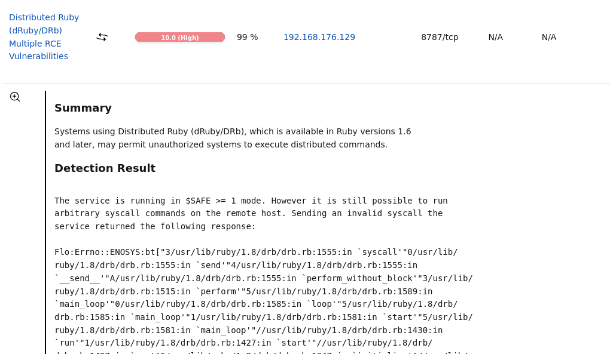
- `nmap` scan showing DRb service exposed on port 8787:
  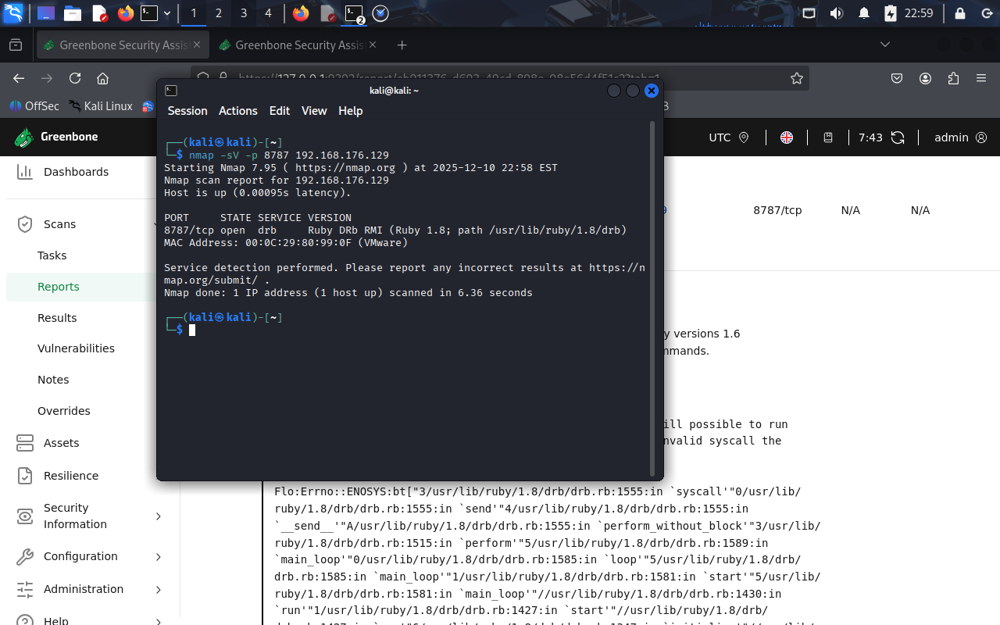
- Snippet of vulnerable DRb Ruby script `druby_timeserver.rb` running with no ACLs and low $SAFE level
  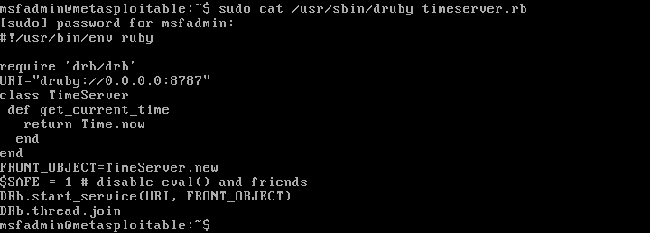

**Root cause analysis:**  
The DRb service was running with insufficient security controls:
- `$SAFE` level was only **1**, which does **not** restrict system calls or dangerous Ruby operations.
- No DRb ACLs (`drb/acl`) were configured, allowing any remote host to connect.
- No input sanitization or taint checking was applied.
- The DRb service was exposed on `0.0.0.0:8787`, making it reachable from external networks.

This configuration allowed the scanner to execute a malicious DRb request and receive a **syscall error trace**, proving arbitrary code execution was possible.

**Remediation performed:**  
1. Restricted DRb access using ACLs (`drb/acl`) to allow only trusted hosts.  
2. Increased Ruby `$SAFE` level to **2** to block unsafe remote operations.  
3. Rebound the DRb service to `127.0.0.1` to eliminate external exposure.
_All changes are shown in the combined configuration below:_  
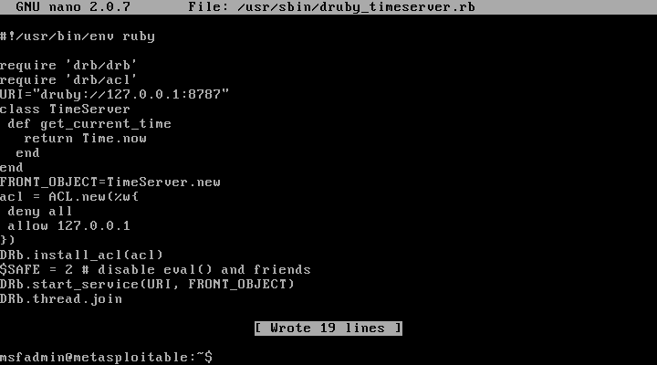
4. Restarted the DRb service to apply the updated ACL and safety settings.
5. Re-scanned using nmap and openVAS to confirm:
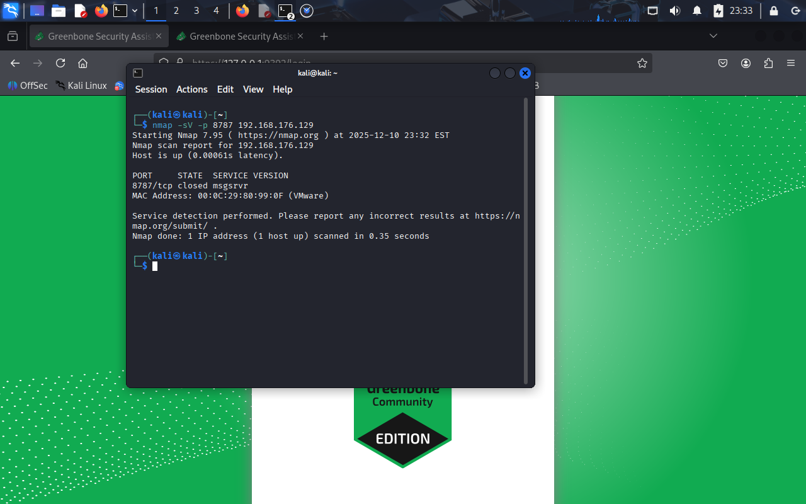

---

### Vulnerability: Telnet Unencrypted Cleartext Login (Port 23) {#telnet-cleartext-login-port-23}
**Severity:** Medium (CVSS 4.8)
**OpenVAS ID / Reference:** NVT – *Telnet Unencrypted Cleartext Login*  

**Description (short):**  
The Telnet service was running on the target host and allowed user authentication
over an unencrypted connection. Telnet transmits credentials in cleartext, making
them vulnerable to interception by any attacker capable of sniffing network traffic.

**Evidence (pre-remediation):**  
- OpenVAS finding reporting Telnet cleartext authentication:
  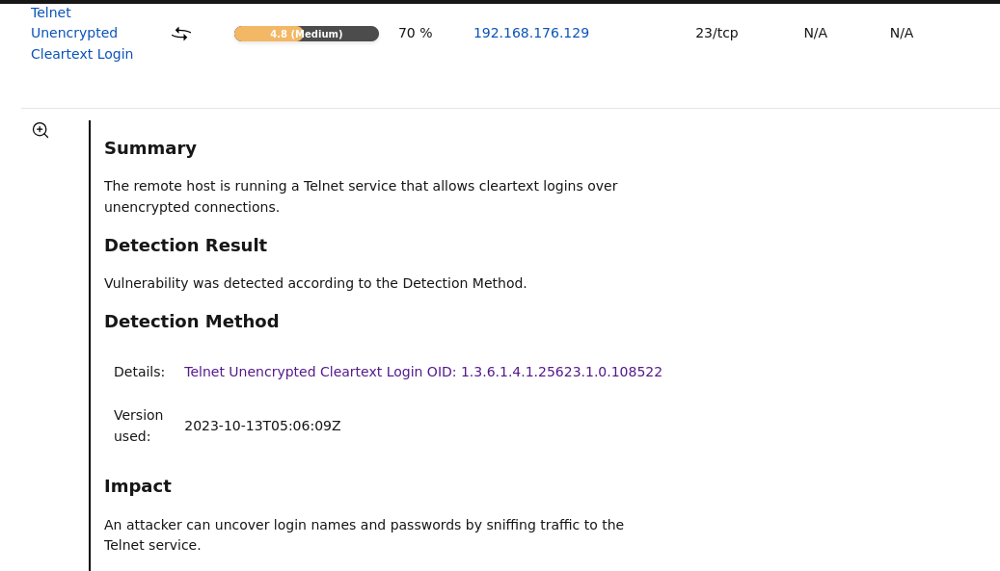
- `nmap` scan confirming Telnet service exposed on port 23:
  
- `Wireshark` showing that login, password is unencrypted and show as plain text:
  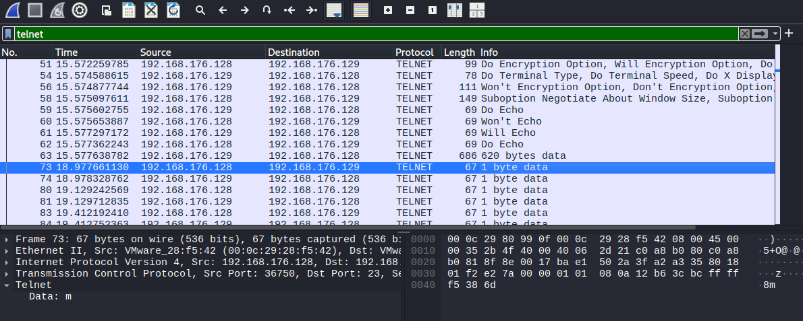

**Root cause analysis:**  
Telnet is an outdated remote access protocol that does not provide encryption for
authentication or session data. The service was enabled and listening on port 23,
allowing credentials to be transmitted in plaintext. Modern security standards
assume untrusted networks and require encrypted transport for remote administration.

This configuration violates CIS Benchmark recommendations to disable insecure
legacy services and minimize exposure to credential interception attacks.

**Remediation performed:** 
1. Identified the Telnet service entry managed by `inetd`.
  
2. Removed the Telnet service configuration from `/etc/inetd.conf` to prevent
  `inetd` from spawning `in.telnetd` on incoming connections.
3. Rebooted the system to ensure the service did not restart.
4.  `nmap` scan confirming port 23 is no longer open:
  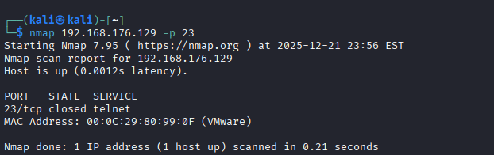
5. Telnet connection rejected:
  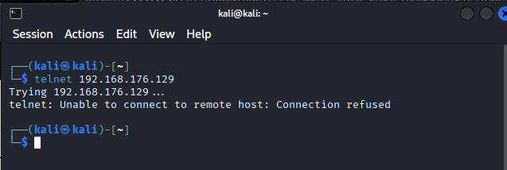

---

### Vulnerability: rsh Unencrypted Cleartext Login (Port 514) {#rsh-cleartext-login-port-514}
**Severity:** High (CVSS 7.5)  
**OpenVAS ID / Reference:** NVT – *rsh Unencrypted Cleartext Login*  

**Description (short):**  
The rsh (remote shell) service was running on the target host and allowed remote
command execution over an unencrypted connection. The service was configured to
permit passwordless authentication or trust-based access, exposing the system to
unauthorized remote command execution and credential interception.

**Evidence (pre-remediation):**  
- OpenVAS finding reporting rsh cleartext authentication and passwordless access:
  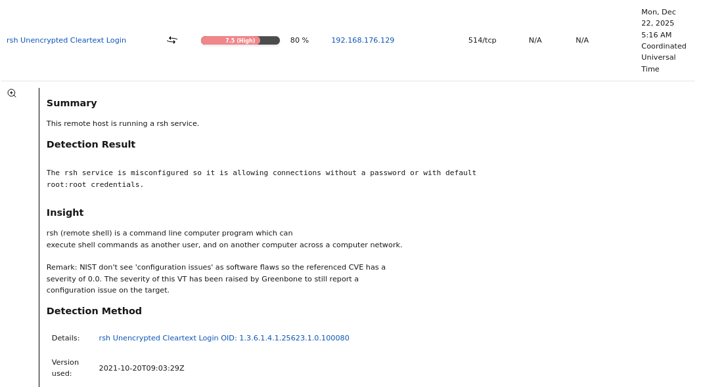
- `nmap` scan confirming the rsh service (`shell`) was exposed on port 514/tcp:
  

**Root cause analysis:**  
The rsh (remote shell) service is a legacy remote access protocol that does not
provide encryption or secure authentication mechanisms. In this configuration,
rsh was enabled via `inetd` and permitted remote command execution without a
password or with default trust relationships, allowing unauthorized access.

This configuration violates modern security standards and CIS Benchmark
recommendations, which explicitly require disabling legacy cleartext protocols
and enforcing encrypted, authenticated remote administration.

**Remediation performed:**  
1. Identified the rsh service entry managed by `inetd`.
  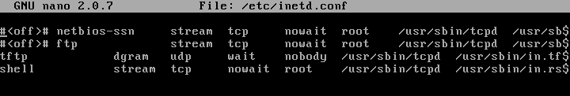
2. Removed the rsh service configuration from `/etc/inetd.conf` to prevent
  `inetd` from spawning `in.rshd`.
3. Rebooted the system to ensure the rsh service did not restart.
4. `nmap` scan confirming port 514/tcp is no longer open:
  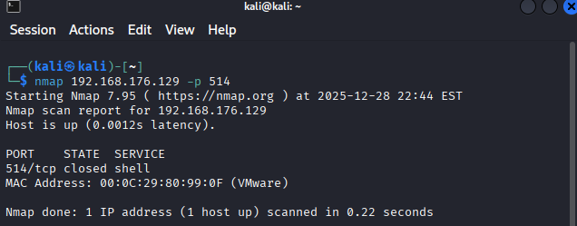

---

### Vulnerability: FTP Unencrypted Cleartext Login (Port 2121) {#ftp-cleartext-login-port-2121}
**Severity:** Medium (CVSS 4.8)  
**OpenVAS ID / Reference:** NVT – *FTP Unencrypted Cleartext Login*  

**Description (short):**  
The FTP service was running on the target host and allowed user authentication
over an unencrypted connection. FTP transmits usernames and passwords in
cleartext, allowing attackers to intercept credentials through network
sniffing.

This configuration violates CIS Benchmark recommendations to disable insecure
legacy services and enforce encrypted alternatives for file transfer.

**Evidence (pre-remediation):**  
- OpenVAS finding reporting FTP cleartext authentication:
  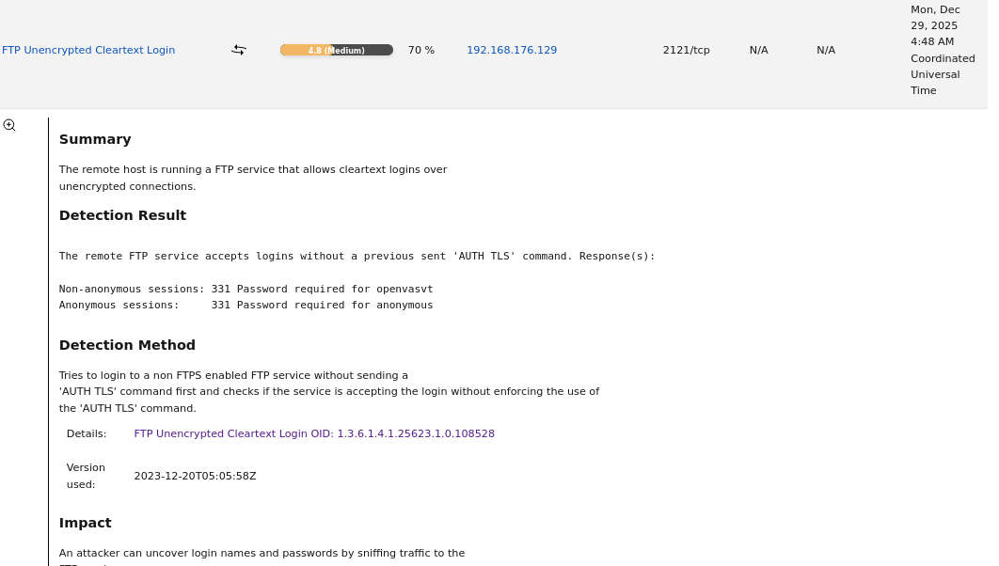
- `nmap` scan confirming FTP service exposed on port 2121/tcp:
  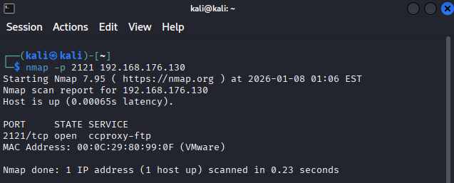
- `Wireshark` capture showing FTP credentials transmitted in plaintext:
  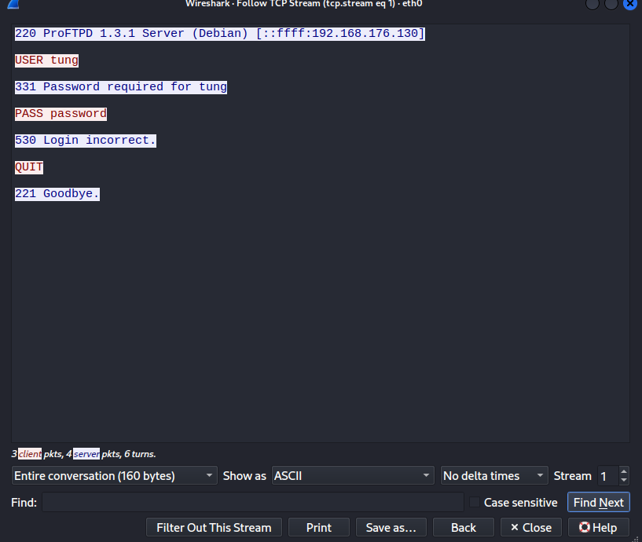

**Root cause analysis:**  
The FTP service was enabled with default configuration and did not enforce
encryption. FTP lacks built-in cryptographic protections, making it unsuitable
for use on untrusted networks.

**Remediation performed:**  
1. Identified the running FTP service (`vsftpd`) listening on port 2121.
2. Stopped the FTP service to prevent further access.
3. Removed the FTP server package to eliminate the service entirely.
  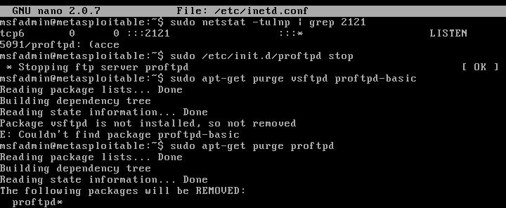
4. Rebooted the system to ensure the service did not restart.
5. `nmap` scan confirming port 2121 is no longer open:
  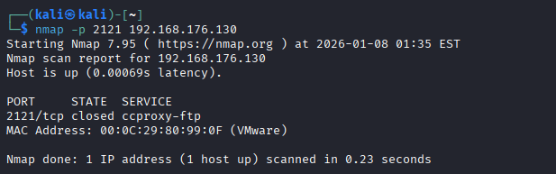

---

### Vulnerability: DistCC Remote Code Execution (Port 3632) {#distcc-rce-port-3632}
**Severity:** High (CVSS 9.3)  
**OpenVAS ID / Reference:** NVT – *DistCC RCE Vulnerability (CVE-2004-2687)*  

**Description (short):**  
The DistCC distributed compiler service was exposed on the network and allowed
unauthenticated remote command execution. An attacker could execute arbitrary
commands on the host without authentication, leading to full system compromise.

This violates CIS Benchmark guidance to disable unnecessary services and reduce
attack surface.

**Evidence (pre-remediation):**  
- OpenVAS finding reporting DistCC remote code execution vulnerability:
  
- `nmap` scan confirming DistCC service exposed on port 3632/tcp:
  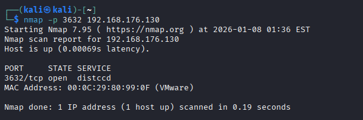

**Root cause analysis:**  
DistCC was installed and running despite not being required for system
operation. The service listens on a network port and accepts commands without
authentication, making it a high-risk exposure.

**Remediation performed:**  
1. Identified the running DistCC service (`distccd`) listening on port 3632.
2. Stopped the DistCC service to immediately prevent exploitation.
3. Disabled DistCC from starting at boot.
4. Removed the DistCC package from the system to permanently eliminate the
   vulnerability.
  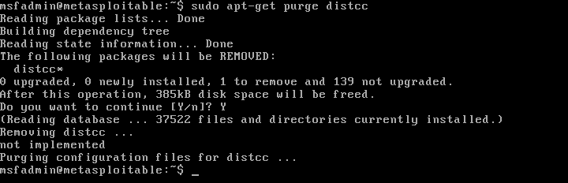
5. Rebooted the system to confirm the service did not restart.
- `nmap` scan confirming port 3632 is no longer open:
  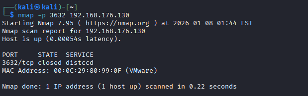

---

### Vulnerability: SSL/TLS OpenSSL CCS Injection Vulnerability (Port 5432) {#openssl-ccs-injection-port-5432}
**Severity:** High (CVSS 7.4)  
**CVE:** CVE-2014-0224  
**OpenVAS ID / Reference:** NVT – *SSL/TLS: OpenSSL CCS Man in the Middle Security Bypass Vulnerability*

**Description (short):**  
The system was running a vulnerable version of OpenSSL that is susceptible to the
ChangeCipherSpec (CCS) injection attack. This vulnerability allows a man-in-the-middle
attacker to bypass SSL/TLS security by forcing the use of a zero-length master key,
potentially allowing session hijacking and disclosure of sensitive information.

**Evidence (pre-remediation):**  
- OpenVAS finding reporting the OpenSSL CCS injection vulnerability:
  
- `nmap` scan confirming PostgreSQL was exposed on port 5432/tcp and
  capable of SSL/TLS communication:
  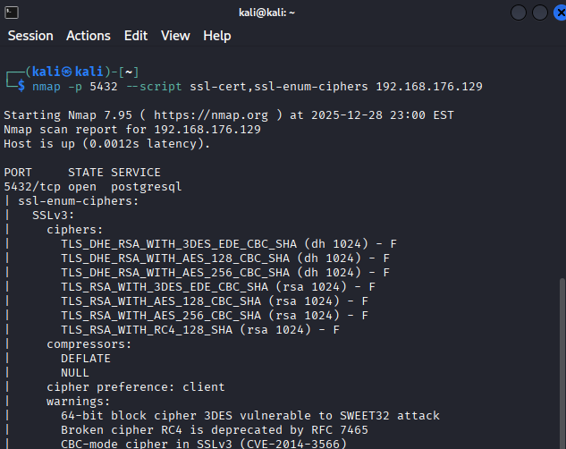
- OpenSSL version check on the target host showing a vulnerable OpenSSL release:
  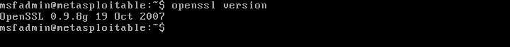

**Root cause analysis:**  
The installed OpenSSL library version was outdated and fell within the range of
affected versions especially `0.9.8g` in this case. This
versions do not properly validate ChangeCipherSpec messages during the TLS handshake.

This issue exists due to insufficient patch management and failure to update
cryptographic libraries in accordance with CIS Benchmark recommendations.

**Remediation performed:**  
Due to the intentionally vulnerable design of Metasploitable 2, traditional
package-based patching of OpenSSL was not feasible. As a result, compensating
controls aligned with CIS Benchmarks were implemented.

1. Disabled SSL support in PostgreSQL to remove the vulnerable cryptographic
   layer:
  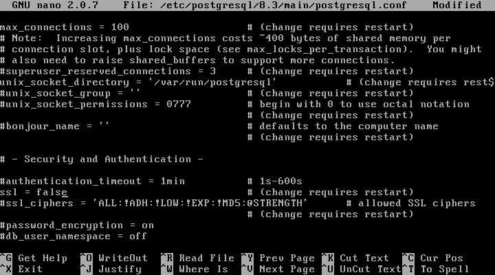
2. Applied host-based firewall rules to restrict access to PostgreSQL (port 5432)
   to trusted hosts only:
  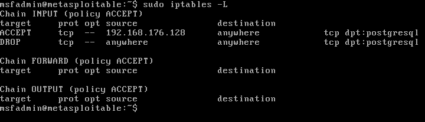
3. Restarted the PostgreSQL service to apply configuration changes
4. `nmap` scan produced no SSL/TLS-related output on port 5432, indicating that PostgreSQL
  was no longer advertising or accepting SSL/TLS connections
  
 
