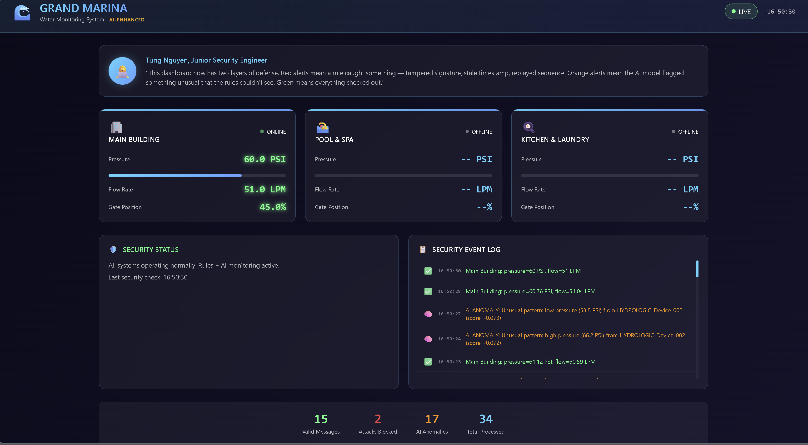

[← Back to Projects](/projects/)

## Overview

Completed a hands-on IoT Cyber Defense externship focused on securing real-world IoT infrastructure for a simulated 500-room smart hotel environment. This program covered threat modeling, secure pipeline design, device identity, encryption, replay attack prevention, monitoring, and AI-based anomaly detection.

The externship simulates the responsibilities of a security engineer defending production-grade IoT systems, with an emphasis on both offensive testing and defensive implementation.

---

## Final Presentation 🎤

### Deliverable
📄 [View Final Presentation (PDF)](../images/Extern_Presentation.pdf)

### Key Highlights
- Walked through the full attack lifecycle:
  - Eavesdropping on insecure MQTT traffic  
  - Message injection and data manipulation  
  - Replay attack execution  
- Demonstrated how each attack was successfully mitigated using:
  - TLS encryption  
  - Mutual TLS (mTLS) authentication   
  - Timestamp and counter-based replay protection  
- Showcased a real-time security dashboard for monitoring IoT telemetry  
- Presented AI-based anomaly detection using Isolation Forest  

### Outcome
- Achieved **100% attack prevention** after implementing security controls  
- Transformed an insecure IoT pipeline into a production-ready secure system  
- Demonstrated practical security engineering skills across the full stack  

### Key Takeaway
Effective IoT security requires layered defenses — encryption, identity, validation, and monitoring must work together to fully protect systems.

---

## Live IoT Security Dashboard



Real-time security dashboard built with Streamlit to monitor device telemetry, detect anomalies, and visualize system health across the IoT pipeline.

- Live flow rate and pressure tracking  
- Automated anomaly detection alerts  
- Detection of leaks, spoofed data, and stuck sensors  

---

## Project 1: IoT Systems & Threat Modeling ✅

### Deliverable
📄 [View Threat Model (PDF)](../images/Tung%20Nguyen%20-%20Threat%20Model%20.pdf)

### Objective
Develop a structured threat model for a simulated smart water management system supporting a 500-room IoT-enabled hotel.

### Work Completed
- Applied the CIA Triad to IoT infrastructure
- Identified six primary IoT attack vectors
- Used STRIDE methodology to systematically uncover vulnerabilities
- Documented risks across authentication, message integrity, and device trust boundaries

### Key Skills
- Threat modeling
- STRIDE framework
- Risk analysis
- Security architecture evaluation

### Key Takeaway
Threat modeling forces clarity. Many vulnerabilities were not obvious until system boundaries and trust relationships were explicitly mapped.

---

## Project 2: Python for IoT Security ✅

### Deliverable
📄 [Download Sample Dataset](https://drive.google.com/file/d/1w_RAv-Gv0Oe6Dn-4y5dmNm1y3tbl5t91/view?usp=drive_link)

### Objective
Built a mock Hydroficient HYDROLOGIC water sensor to simulate realistic IoT telemetry for downstream security testing and anomaly detection.

### Implementation Highlights
- Designed a `WaterSensor` class in Python
- Generated ISO 8601 UTC timestamps
- Implemented sequential counters for replay attack detection
- Simulated realistic pressure and flow values
- Injected controlled anomalies:
  - Leak (abnormally high flow rate)
  - Blockage (pressure imbalance)
  - Stuck sensor (static readings)
- Generated and exported 100 structured JSON records

### Sample Output

```json
{
  "device_id": "GM-HYDROLOGIC-01",
  "timestamp": "2026-02-19T03:35:05.551904+00:00",
  "counter": 6,
  "pressure_upstream": 81.3,
  "pressure_downstream": 75.9,
  "flow_rate": 99.5
}
```

---

## Project 3: Building an Insecure MQTT Pipeline ✅

### Deliverable
📄 [Download Vulnerability Assessment of Insecure MQTT Pipeline](../images/Hydroficient%20-%20Vulnerability%20Assessment.pdf)

### Objective
Construct and exploit an intentionally insecure MQTT data pipeline to understand real-world interception, tampering, and replay risks in IoT environments.

### Work Completed  
- Deployed a local Mosquitto MQTT broker  
- Configured Python-based telemetry publisher and dashboard subscriber  
- Transmitted unencrypted telemetry over default MQTT port 1883  
- Intercepted live MQTT traffic using wildcard topic subscriptions (`#`)  
- Demonstrated message injection and replay attack scenarios  

### Security Findings  
- No TLS encryption (all data transmitted in plain text)  
- No client authentication required to connect to the broker  
- No topic-level authorization controls  
- No message integrity verification or replay protection  

### Key Skills  
- MQTT protocol fundamentals  
- Network traffic interception  
- Publish/subscribe exploitation  
- IoT attack surface analysis  

### Key Takeaway  
IoT systems are insecure by default. Without encryption, authentication, and access control, attackers can silently observe, manipulate, or disrupt operational data flows.

---

### Project 4: Securing the Pipeline with TLS ✅

### Deliverable
📄 [Download Secure MQTT Configuration & TLS Setup](../images/Security%20Assessment%20Report.pdf)

### Objective  
Harden the MQTT pipeline using encryption, authentication, and access control.

### Implementation Highlights  
- Configured Mosquitto to enforce TLS (port 8883)  
- Generated and managed X.509 certificates  
- Implemented TLS for device authentication   

### Key Takeaway  
Strong encryption and identity enforcement transform MQTT into a secure communication layer.

---

## Project 5: Device Identity & Secure Provisioning ✅

### Deliverable
📄 [Download Device Identity & Provisioning Report](../images/Provisioning%20Policy.pdf)

### Objective  
Prevent rogue device access using certificate-based identity.

### Work Completed  
- Implemented unique client certificates per device  
- Established PKI-based identity verification  
- Blocked unauthorized device connection attempts  

### Key Takeaway  
Device identity is critical to preventing impersonation attacks.

---

## Project 6: Replay Attack Simulation & Defense ✅

### Deliverable
📄 [Download Replay Attack Analysis](../images/Replay_attack_report.pdf)

### Objective  
Simulate replay attacks and implement detection mechanisms.

### Work Completed  
- Replayed captured MQTT messages  
- Implemented timestamp + counter validation  
- Rejected duplicate and stale messages  

### Key Takeaway  
Replay protection requires both time-based and sequence-based validation.

---

## Project 7: Real-Time Security Dashboard ✅

### Deliverable
📄 [View Dashboard Demo / Screenshots](../images/IoT_Dashboard.png)

### Objective  
Build a live monitoring system for IoT telemetry.

### Implementation Highlights  
- Built dashboard using Streamlit  
- Visualized real-time telemetry and anomalies  
- Highlighted suspicious patterns  

### Key Takeaway  
Real-time visibility is essential for detecting and responding to threats.

---

## Project 8: AI-Based Anomaly Detection ✅

### Deliverable
📄 [View Anomaly Detection Report](https://docs.google.com/document/d/1U6LYfeIW0HG0V-fqeoWL2PGpLZcXECIJ5P5jRoELqis/edit?usp=sharing)

### Objective  
Detect abnormal IoT behavior using machine learning.

### Implementation Highlights  
- Applied Isolation Forest  
- Detected spoofed data and abnormal patterns  
- Evaluated model performance on injected anomalies  

### Key Takeaway  
AI enables detection of complex, non-obvious attack patterns.

---

## Technologies Used
- Python  
- Pandas  
- MQTT (Mosquitto)  
- TLS / mTLS  
- X.509 Certificates  
- Streamlit  
- Isolation Forest  
- STRIDE Threat Modeling  

---

## Final Outcome

- Built and exploited insecure IoT systems  
- Implemented full-stack security defenses  
- Achieved **100% attack mitigation**  
- Developed monitoring and AI-based detection  

---

## Status
✅ Completed (All 8 Projects)